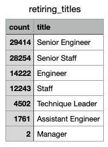

# Pewlett-Hackard-Analysis

## Purpose
The puspose of this analysis is to determine the number of retiring employees per title and identify the employees who are eligible to participate in the "silver tsunami" mentorship program. 

## Results
Here are the findings: 
1. 90,398 employees were born in the years 1952 through 1955 and are eligible for retirement. 
2. Here's the distribution by employee title of employees who are eligible for retirement: 

3. 1,549 employees were born in the year 1965 and are eligible to participate in the "silver tsunami" mentorship program. 
4. Here's the distribution by employee title of employees who are elibilbe to participate in the "silver tsunami" mentorship program:

## Summary
90,398 roles will need to be filled as the "silver tsunami" begins to make an impact. Yet, only 1,549 employees qualify for the "silver tsunami" mentorship program. There are not enough qualified, retireemnt-ready employees in the department to mentor the next generation of Pewlett Hackard employees. Here's how many mentees a "silver tsunami" mentor would need to mentor: 
1. Each Senior Engineer mentor would need to mentor 74 Senior Engineer mentees (29,414 Senior Engineers qualify for retirement/396 Senior Engineer mentors). 
2. Each Senior Staff mentor would need to mentor 96 Senior Staff mentees (28,254 Senior Staff qualify for retirement/292 Senior Staff mentors).
3. Each Engineer mentor would need to mentor 46 Engineer mentees (14,222 Engineers qualify for retirement/310 Engineer mentors). 
4. Each Staff mentor would need to mentor 28 Staff mentees (12,243 Staffs qualify for retirement/432 Staff mentors).
5. Each Technique Leader mentor would need to mentor 58 Technique Leader mentees (4,502 Technique Leaders qualify for retirement/77 Technique Leader mentors).
6. Each Assistant Engineer mentor would need to mentor 42 Assistant Engineer mentees (1,761 Assistant Engineers qualify for retirement/42 Assistant Engineer mentors).

